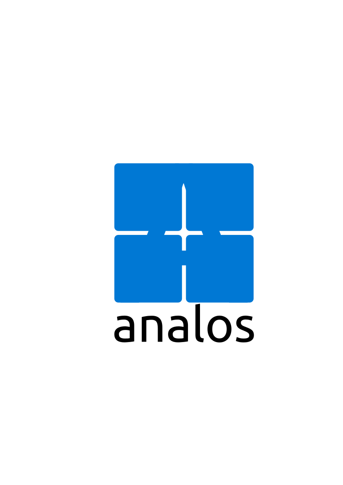

# AnalOS 🚀

  

  
  
  

---

## 🌍 Language / Язык
* [English](#english)
* [Русский](#русский)

---

## English

### 📝 About the Project
**AnalOS** is an independent, lightweight 32-bit operating system for the **x86** architecture, built entirely from scratch by a single developer. The compiled OS image takes up only **10 MB**.

The system boots via a **custom assembly bootloader**, switches to **32-bit protected mode**, and implements modern interrupt handling. Testing is performed both in the **QEMU** emulator and on bare metal (**Intel Celeron**).

### 🛠️ Built With
* **C & C++** — Kernel core and primary system logic.
* **Assembly** — Low-level initialization and custom bootloader.
* **Python** — Scripting for font conversion and asset building.
* **Rust** — *(Coming Soon)* Planned integration for panic handling and safety.
* **NeoVim** — The primary IDE used for development.

### ✨ Current Features
* 📺 **High-Res Graphics:** VESA 1280x1024 mode with full RGBA color support.
* 🖱️ **GUI Core:** Functional mouse cursor.
* 💻 **Window Manager:** Movable windows featuring interactive **Drag & Drop** via XOR rendering.
* 🕒 **Desktop Environment:** A functional **Taskbar** with a "Start" button and a real-time clock.

### 🗺️ Roadmap
- [x] Custom Bootloader & 32-bit Protected Mode transition
- [x] Interrupt handling
- [x] VESA 1280x1024 RGBA Graphics
- [x] Taskbar, Mouse Cursor, and XOR Window Drag & Drop
- [ ] Rust integration (Panic handling & kernel modules)
- [ ] Multi-tasking and system optimization
- [ ] Sound driver support

### 🤝 Contributing
The project frequently faces low-level development challenges. If you want to help, contributors are more than welcome! 

Ideally, you should have a deep understanding of **system languages**, and low-level development concepts. Feel free to open issues or submit PRs. My TikTok: https://www.tiktok.com/@_analos_?is_from_webapp=1&sender_device=pc !

---

## Русский

### 📝 О проекте
**AnalOS** — это независимая, легковесная 32-битная операционная система для архитектуры **x86**, разрабатываемая с нуля силами одного человека. Вес готового образа составляет всего **10 мегабайт**.

Система запускается через **собственный загрузчик на Assembly**, успешно переходит в **защищённый 32-битный режим** и работает с прерываниями. Тестирование проекта проходит как в эмуляторе **QEMU**, так и на реальном железе (**Intel Celeron**).

### 🛠️ Стек технологий
* **C & C++** — Ядро и основная системная логика.
* **Assembly** — Низкоуровневая инициализация и кастомный загрузчик.
* **Python** — Скрипты для конвертации шрифтов и сборки ресурсов.
* **Rust** — *(В планах)* Интеграция для обработки паники (panic handling) и повышения стабильности.
* **NeoVim** — Основной инструмент, в котором пишется код ОС.

### ✨ Что уже реализовано
* 📺 **Графика высокого разрешения:** Режим VESA 1280x1024 с полноценной поддержкой RGBA-цветов.
* 🖱️ **Базовый GUI:** Рабочий курсор мыши.
* 💻 **Оконный менеджер:** Окна с поддержкой технологии **Drag & Drop** через XOR-рендеринг.
* 🕒 **Элементы интерфейса:** Рабочий **Taskbar** (панель задач), кнопка «Пуск» и отображение времени.

### 🗺️ План развития (Roadmap)
- [x] Кастомный загрузчик и переход в 32-битный защищённый режим
- [x] Настройка прерываний
- [x] Графика VESA 1280x1024 RGBA
- [x] Панель задач, курсор мыши и XOR Drag & Drop для окон
- [ ] Внедрение Rust (обработка паники и модули ядра)
- [ ] Многозадачность и общая оптимизация системы
- [ ] Поддержка звуковых драйверов

### 🤝 Хотите помочь?
Разработка ОС с нуля — штука непростая, и проект часто сталкивается с трудностями. Если у вас есть желание помочь развитию AnalOS, я буду только рад!

Приветствуются люди со отличным знанием **системных языков**. Создавайте код, пишите мне на почту или в тик ток аккаунт от которого вы скорее всего и пришли: https://www.tiktok.com/@_analos_?is_from_webapp=1&sender_device=pc !

---

Разработано с ❤️ для open-source сообщества.

Давайте заглянем в историю AnalOS поподробнее. Первая версия AnalOS - 1.1.0 была опубликована 14-отого марта 2026 года, тогда она просто выводила следующий текст:
AnalOS-NG: Press any key to boot...
Loading kernel...
SKernel loaded, jumping...
Эти строки были написаны для проверки, первая буква которая перекрывала A в слове AnalOS-NG была K но могла быть другой если произошла ошибка, AnalOS-NG означает лучшую на данный момент версию AnalOS, она тестировалась в QEMU, давайте перейдём к версии 1.2.2, тогда она выводила данный текст:
AnalOS-NG Kernel v1.0

=====================

Hello, world!
Если вы подумали что надпись v1.0 это ошибка, это не так, она была написана случайно ведь тогда ещё не было того счёта версий поэтому все версии вплоть до 3.x.x были обозначены как v1.0, ничего нового не произошло, она всё таже тестировалась в QEMU. Тут мы уже подходим к версии 2.3.1, здесь она тоже объявлена как v1.0 хоть это и не так, не переживайте, скоро она станет на своё место, вот что она выводила:
AnalOS-NG Shell v1.0

====================

Commands: help, clear, echo, reboot
И курсор в виде >, как мы можем увидить тут уже можно вводить команды и тут они есть! Это настоящий прорыв ведь на тот момент были написаны только вывод текста и переход в защищённый режим, а тут уже и драйвер клавиатуры с рабочими командами, команда help выводила список комманд, clear очищала экран, echo выводила следующий текст например так: echo hello world вывод: hello world. Ещё была команда reboot, она перезагружала систему, не ПК! Только ОС для очистки и если начала бы лагать то после reboot перестала бы. Она была выпущена 16-ого марта 2026 года, да, прошлая версия 15-ого марта, обновления выходили каждый день. Давайте плавно переходить к AnalOS 2.4.3, здесь особо ничего не изменилось, только слегка поменялось реагирование на неопознанные комманды и пофиксились баги. Следующая версия стала началом той которую можно увидеть сейчас, это версия 3.5.4, это уже 3.x.x поэтому как я и обещал тут уже нету надписи v1.0, она выводило это:
AnalOS-NG Keyboard Test

=======================

Loading IDT... OK
Initializing keyboard... OK

DEBUG: Watch top-right corner for hex code
Press keys to see scancode in hex
Press ESC to continue shell

Также этот текст был на голубом фоне, добавилась команда uname -r которая выводила версию и имя, больше ничего особенного не добавилось, ОС всё ещё тестируется в QEMU. Давайте посмотрим на AnalOS 3.6.7, туда добавилась ФС, только на RAM диске но на тот момент это уже было неплохо, кстати начиная с этой ОС обновление стали выходить каждые 2 дня а иногда и больше, была причина и эта версия вышла только 5-ого мая 2026 года, туда добавились команды touch ls и новые цвета для текста, для системного - жёлтый, для привественной надписи - белый, для ввода или одобрения - зелёный. В версии 3.7.2 практически ничего не поменялось, вот уже в версии 3.8.4 всё кардинально изменилось, была сделана графика, пока что она просто выводила 3 квадрата, красный зелёный и синий ну и в основном это всё. В версии 3.9.7 AnalOS начала тестироваться на реальном ПК, были сделаны 3 буквы? ABC и возможность их ввода, эта версия была написана 30-ого мая. В версии 3.10.2 ничего кроме цветовой гаммы и улучшенного принятия ввода не изменилось, идём дальше. Тут начинается эпоха widnows, были использовани их основные вета, даже панель задач снизу не из белого а из 229 236 253 по RGB и она такая до сих пор

Как запустить:
1. Установите QEMU если ещё он не установлен **УПРАЗДНЕНО, РАБОТА С QEMU ПРЕКРАЩЕНА С ВЕРСИИ 3.9.0**.
2. Введите команду make clean && make предварительно зайдя в папку AnalOS псоле чего вставьте флешку в пк и введите lsblk, посмотрите как называется ваша флешка и запишите на неё образ с помощью команды  sudo wipefs -a /dev/sdb && sudo dd if=/dev/zero of=/dev/sdb bs=1M count=10 status=none && sudo dd if=os-image.img of=/dev/sdb bs=4k status=progress && sync ВАЖНО: вместо sdb введите название вашей флешки например sdb, sda, sdc и не sdc 1 или sdc 2 а саму флешку после чего она будет абсолютно чиста с записью ОС, заходите в boot menu и выберайте там свою флешку, если вы введёте неправильное название то есть шанс что ваша система умрёт навсегда. Также для интереса вы можете посмотреть код.

Пока что AnalOS на промежуточном этапе и там только графика с драйверами клавиатуры для символов a, b и c. Но совсем скоро (примерно 2 - 3 дня) будет добавлено то что было ранее, то есть:
1. Файловая система.
2. команды. (но уже в отдельном терминале)
3. И новововведения: приложения, меню и всё что необходимо для нормальной ОС.

Этот проект распространяется под лицензией CC BY-NC-SA 4.0
